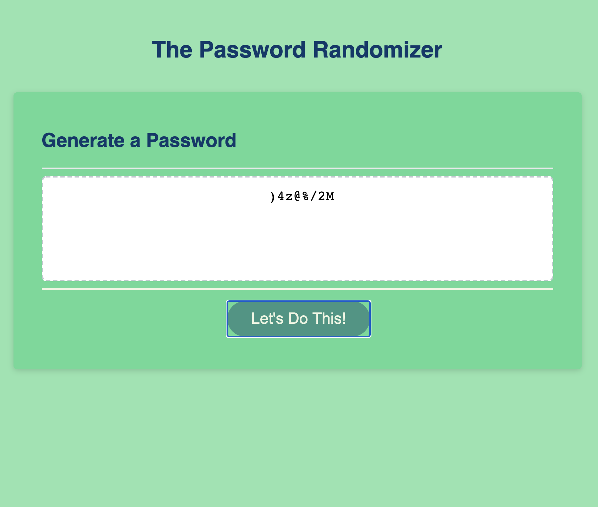

# The Password Randomizer

## Scope of Project

* the purpose of this project is to create a webpage with a tool that can provide a random password to a users preferred length and/or including numbers and special characters.

## Functionality of Tool

* when going to the website, user will press a generate password button.

* Once pressed the user will be prompted to give a number between 8 and 128 for password length.

* the user will then confirm or cancel if they would like to include uppercase letters, numbers and special characters.

* the User will then have a random set of characters "printed" into the message box in desired length.

## How this is achieved

* Created an Array of lowercase letters then will add uppercase letters, numbers and special characters to the array when confirmed using if statements.

* created a generate password function to send prompts and confirms to the user and then run multiple for loops to generate set number of characters.

* used multiple arrays to guarantee each type selected will occur at least once within desired password generated.

## Stylized

* modified starting css file to desired color palette.

## Website Example

[Final Webpage](https://beccablanton.github.io/password_randomizer/)
